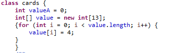

# Blackjack
## Synopsis
This is the commonly play card game BlackJack, just follow on screen instructions.
## Motivation
I made the as my final project for a class because i enjoy blackjack and wated to see how i could implement a shuffle feature
## How to Run
the only file needed to run it is BlackJack.java, so just run that one

## Code Example
I like this code because it was a simple solution to the problem of how I would count the cards 

## Tests
using JUnit4 just go to cardsTest and click the run button
## Contributors

This code is Finished, however feel free to make desired improvements

contributors: Garron Haley

