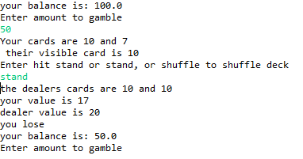

# Blackjack
## Synopsis
This is the commonly play card game BlackJack, just follow on screen instructions.
## Motivation
I made the as my final project for a class because i enjoy blackjack and wated to see how i could implement a shuffle feature
## How to Run
#### the only file needed to run it is BlackJack.java, so just run that one

## Code Example
I like this code because it was a simple solution to the problem of how I would count the cards
```
class cards {
	int valueA = 0;
	int[] value = new int[13]; 
	{for (int i = 0; i < value.length; i++) { 
		value[i] = 4;
	}
	}
```
